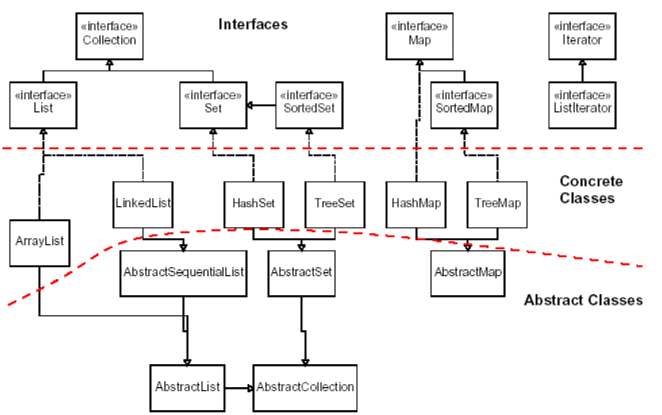

# Collections

In this lesson we will learn about the `Java Collection Framework`. There are many `abstract` classes, concrete classes, and interfaces that make up the framework.

We will look at a class hierarchy showing `interfaces`, `abstract` classes, and concrete classes. The point is to see how code is shared by using the abstract classes, and behaviors are provided by classes not necessarily in the same path.  

We also want to review the most fundamental data structures.  

## Fundamental Structures
We will use conceptual names that map to `interfaces`. And we will show the most popular types of classes used to implement that behavior.  
|Type|Class|Notes|
|----|-----|-----|
|List|ArrayList| |
|    |LinkedList|  |
|Queue|LinkedList| |
|     |ArrayDeque| |
|Stack|Stack|`Stack` is a concrete class. Slow.| 
|     |LinkedList|Acts as both a Stack and a Queue via interface `Deque`|
|     |ArrayDeque|Acts as both a Stack and a Queue via interface `Deque`| 
|Set|HashSet| |
|   |TreeSet| |
|Map|HashMap| |
|   |TreeMap| |
  

