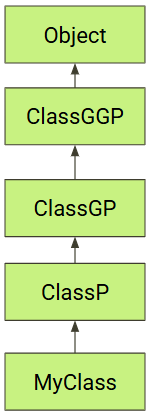

# Constraint Typing

In this lesson we learn:  
1. why we need to constrain our types  
2. The syntax of Contraint Typing  


## Overview
Constraint typing allows a generic method to safely call methods that exist on required interface implementations or inheritance from parent classes. Constrainst estable an IS-A relationship and eliminate the need to blindly (and unsafely) type cast.  

For example, we may want to call a generic method where we are guaranteed that our generic type `<T>` implements the interface `Runnable`. We would do that as follows:  

```java
public static <T extends Runnable> runIt(T t) {
    // Do stuff with the object t
    ...
    // then run it since it implements the Runnable interface
    t.run();
}
```

### Syntax & Terminology
There are two keywords used in constraint typing: `extends` and `super`. The most common syntax you'll see is:  
    `<T extends SuperClass>` : This means that `T` is SuperClass or any subtype of SuperClass.    


At times, we do not know the type of the object; we only know the relationship to some other type. In these cases we would use **Wildcards** `?`.  
1. `? extends T` : The `?` represents any class that is `T` or any subclass of `T`.   
2. `? super T` : The `?` represents any class that is `T` or any supertype of `T`.    

We also make use of these two terms:  
1. **Upper Bound** : A constraint using the `extends` keyword.  
2. **Lower Bound** : A constraint using the `super` keyword.  

Note that `<T super ChildClass>` is invalid! We are required to use the **wildcard** when using `super` to set the **Lower Bound**.  

## Discussion on Bounds

Let's first describe what the `Type Parameter Section` means.  
```java
public static <type parameter section> ReturnType methodName(parameters)

// The <T> is the type parameter section
public static <T> void method1(List<T> list) { }

// The <T extends Number> is the type parameter section  
public static <T extends Number> T method2(List<T> list) { }

// The <T, U extends String> is the type parameter section
public static <T, U extends String> void method3(T item, U text) { }
```
### Upper Bound (extends)
When we specify that the type must be a subclass of a particular class, we call this an **Upper Bound**. Let's draw a class diagram with the parent class at the top and several derived subclasses.

  
```java
// This generic method sets the Upper Bound to `ClassGP`
// Using the class hierarchy diagram, we can see that `T`
// is ALLOWED to be: 
//     ClassGP, ClassP, or MyClass.
// These three classes are at or below the Upper Bound.
//
// DISALLOWED: 
//     ClassGGP, Object 
// These two classes are above the upper bound.
public static <T extends ClassGP> example(T t) { }
```
The following code shows a longer example of using an **Upper Bound** constraint. It shows the benefits of using **Generics** versus simply using the base class `Node`.  

```java
public class Node {
    public Node left;
    public Node right;
    /* other code not shown */
}

public class BSTNode extends Node { }

public class GrandNode extends BSTNode { }

public class Example {
    // ---- Generic implementation ---
    
    public static <T extends Node> List<T> getListGeneric(T root) {
        List<T> list = new ArrayList<>();

        // T is-a Node. We can treat it as a Node object even if it is not
        // precisely a Node. It could be a BSTNode. No casting necessary.
        System.out.printf("Left child: %s\n", root.left);

        /* Code that add nodes to the list is not shown */

        // we return a List<T> where `T` is precisely the type we want
        return list;
    }

    public static <T extends Node> T findNodeGeneric(T root) {
        T node = /* code not shown to find special node */
        return node;
    }

    // ---- NON-Generic implementation of the code above ----

    public static List<Node> getList(Node node) {
        List<Node> list = new ArrayList<>();
        System.out.printf("Left child: %s\n", node.left);
        /* Code to generate list is not shown */
        // we return a List<Node>
        return list;
    }

    public static Node findNode(Node root) {
        Node node = /* code not shown */
        return node;
    }

    // ---- Show how we call Generic and NON-Generic methods ----

    public static void callIt() {
        // creates a tree for us to use use
        GrandNode root = createGrandTree();   

        // ---- call generic methods ----
        List<GrandNode> list = getListGeneric(root);    // List is accurately typed
        GrandNode node = findNodeGeneric(root);         // no need to type cast
        GrandNode firstNode = list.get(0);              // no need to type cast

        // ---- call the non-generic methods ----
        List<Node> list = getList(root);                // List is poorly typed

        // We are not allowed to type cast the list itself
        // List<GrandNode> list = (List<GrandNode>) getList(root); // Won't work!!

        GrandNode node = (GrandNode) findNode(root);    // Type Casting **required**
        GrandNode firstNode = (GrandNode) list.get(0);  // Type Casting **required**
    }
}
```
In the code above, the generic implementation uses constraints so that the generic type `T` can be `Node` or any subclass of `Node` such as `BSTNode` or `GrandNode`. When we call the generic methods, the results are typed exactly as we want them.

It may seem like we could accomplish the same thing by having the methods accept the base class `Node`. You can see what when we call the non-generic methods, the return types are `Node` and we must resort to type casting to get the types we want.  

### Lower Bound (super)
When we want the type must be the class or a superclass of a particular class, this is called a **Lower Bound**. Let's once again draw a class hierarchy diagram to illustrate how **Lower Bound** works.

  
```java
// This generic method sets the Lower Bound to `ClassGP`.
// Using the class hierarchy diagram, we can see that 
// we can have the following type of Lists
// ALLOWED: 
//     List<ClassGP>, List<ClassGGP>, List<Object>
//
// DISALLOWED: 
//     List<ClassP>, List<MyClass>
public static void example(List<? super ClassGP> list) { }
```
In the above code, note that we cannot put the wildcad `?` in the _Type Parameter Section_. We are not allowed to use the wildcard there. Furthermore, we are not allowed to use `T`. Both of the following are invalid:  

```java
// wildcard not allowed in Type Parameter Section
public static <? super ClassPG> void example(List<?> list) { }

// T is not allowed to set a Lower Bound using `super`
public static <T super ClassPG> void example(List<T> list) { }
```

Let's look at another example this **Lower Bound**.
```java
// setting a lower bound for '?' so that it must be:
// ClassP, ClassGP, or Object
public static void addToList(List<? super ClassP> list) {
    // have our list consume objects
    list.add(new ClassP());
    list.add(new MyClass());
}

public static void callAddToList() {
    List<Object> list = new ArrayList<>();
    addToList(list);

    List<ClassP> list2 = new ArrayList<>();
    addToList(list2);
}
public static <T> void addToList2(List<? super T> list, T item) {
    list.add(item);  // Safe - T is-a (? super T)
}

public static void callAddAgain() {
    // Usage examples:
    List<Number> numbers = new ArrayList<>();
    List<Object> objects = new ArrayList<>();

    addToList2(numbers, 42);        // T=Integer, List<? super Integer> accepts List<Number>
    addToList2(objects, "hello");   // T=String, List<? super String> accepts List<Object>
    addToList2(numbers, 3.14);      // T=Double, List<? super Double> accepts List<Number>
}
```

## Extending an Interface

```java

    // TODO: show how this is the logical rewrite of the code
    public static <T extends Comparable<T>> void example3(List<T> list) {
        for (int i = 0; i < list.size() - 1; i++) {
            T t1 = list.get(i);
            T t2 = list.get(i+1);
            int cmp = t1.compareTo(t2);
            System.out.println(cmp);
        }
    }

    // found in the .class file to manage the Constraint. 
    public static <T extends Comparable<T>> void example3(List<T> list) {
        for(int i = 0; i < list.size() - 1; ++i) {
            T t1 = (Comparable)list.get(i);
            T t2 = (Comparable)list.get(i + 1);
            int cmp = t1.compareTo(t2);
            System.out.println(cmp);
        }
    }

    // runtime code after Type Erasure
    public static void example3(List list) {
        for(int i = 0; i < list.size() - 1; ++i) {
            Comparable t1 = (Comparable) list.get(i);
            Comparable t2 = (Comparable) list.get(i + 1);
            int cmp = t1.compareTo(t2);
            System.out.println(cmp);
        }
    } 
```
## PECS  (Producer Extends, Consumer Super)
**Producer Extends:**  
Use `? extends T` when you are reading from, or producing something from a collection.
```java
 public void processElements(List<? extends Number> list) {
      for (Number num : list) {
          System.out.println(num);
      }
  }
```
**Consumer Super:**  
Use `? super T` when you are writing to a collection, or when something is _consuming_ the objects.
```java
public void addElements(List<? super Number> list) {
    list.add(1); // Adding an Integer
     list.add(1.0); // Adding a Double
}

public void callIt() {

}
```

## Reviewing Valid & Invalid Syntax
```java
// ✅ Valid in type parameter section:
public static <T> void method() { }
public static <T extends SomeClass> void method() { }
public static <T extends Class1 & Interface1> void method() { }

// ❌ Invalid in type parameter section:
// Wildcards cannot appear in the Type Parameter Section
public static <? extends SomeClass> void method() { }
public static <? super SomeClass> void method() { }
public static <?> void method() { }

// ✅ Wildcards are allowed to define the types of the parameters and return types
public static void method(List<? extends Number> param) { }
public static List<? super String> getList() { }
```

**Summarizing `extends` and `super`**  
|Bound Type|Wildcard `?`|Using `T`|
|----------|------------|--------------------|
|Upper (`extends`)|✅ `? extends Type`|✅ `T extends Type`|
|Lower (`super`)|✅ `? superType`| ❌ `T super Type` Not Allowed|

Wildcards can ONLY be used as type arguments in parameter types, return types, and variable declarations.  

**Wildcard Usage:**  
```java
// ✅ Valid - wildcards in method parameters
public static void method(List<? super Integer> list) { }
public static List<? extends Number> getList() { }

// ✅ Valid - wildcards in variable declarations  
List<? super String> myList;

// ❌ Invalid - wildcards in type parameter section
public static <? super ClassP> void method() { } // ❌ Invalid
public static <? super String> void method(List<?> list) { } // ❌ Invalid
```
<a id="wildcards"></a>

## Constraint Typing
We can bound constrain type parameter, and we can have Bounded Wildcards. By constraining our types via **bounding**, we enable flexibility and code reuse. Let's look at each.  

### Constrain (Bound Type Parameter)
There are times where we require a parameter of a generic type to extend (or implement) something. We do this with as follows:  

```java
public static <T extends Comparable<T>> reverseCompare(T o1, T o2) {
    // We can't call `compareTo` if the object of type `T` doesn't
    // implement `Comparable`. Luckily, we required this in the prototype.
    return o2.compareTo(o1);
}  

```

### Bounded Wildcards  
Bounded wildcards make your code more flexible and reusable while maintaining type safety.  

Bounded wildcards in Java are used to impose restrictions on the types that can be passed to a generic method, class, or interface. They are represented using the `?` symbol (the **wildcard symble**), combined with bounds (`extends` or `super`) to define the range of acceptable types. There are three types of Bounded Wildcards.  

#### Upper-Bounded Wildcards (? extends T)

Restricts the wildcard to a specific type `T` or its subclasses.
Useful when you want to read data from a structure but not modify it.
Example:
```java
public void processNumbers(List<? extends Number> list) {
    for (Number num : list) {
        System.out.println(num);
    }
}
```

Here, list can accept `List<Integer>`, `List<Double>`, or any subclass of `Number`.

#### Lower-Bounded Wildcards (? super T)

Restricts the wildcard to a specific type `T` or its superclasses. Note that a class can be considered a superclass of itself. `T` is a superclass of `T`.   

In the code below we require the Comparator to have a generic type that is a superclass of `T`. This way, we can make use of the Comparator in the `Person` class, the superclass of `Kid`. We are also allowed to use the Comparator found in the `Kid` class.  

```java
public class Person {
    public int age;
    public static int compareByAge(Person p1, Person p2) {
        return p1.age - p2.age;
    }
}

public class Kid extends Person {
    public int dominance;
    public static int compareByDominance(Kid k1, Kid k2) {
        return k1.dominance - k2.dominance;
    }
 }

public class Example {
    public void example(Kid k1, Kid k2) {
        System.out.printf("Person Comparison: %d\f", 
                           reverseCompare(k1, k2, Person::compareByAge));
        System.out.printf("   Kid Comparison: %d\f", 
                           reverseCompare(k1, k2, Kid::compareByDominance));
    }

    public static <T> int reverseCompare(T o1, T o2, Comparator<? super T> comparator) {
        return comparator.reversed().compare(o1, o2);
    }
}
```

#### Unbounded Wildcards (?)

Represents an unknown type without any restrictions.
Useful when you don't care about the type but want to ensure type safety. This is especially helpful when we have to deal with `Type Erasure`.   
Example:
```java
// In this implementation, we want to assure that the object passed in
// is a Map and not a supertype or subtype. It must be exactly a Map.
// It can be a map with Keys and Values of any type.
// If it is a Map, then let's say that they are equal if they are
// the same size.
@Override
public boolean equals(Object obj) {
    // Using getClass() for equality checks is very strict and often discouraged 
    // unless you have a specific reason to disallow subclass equality. 
    // Most Java APIs (like Map.equals) use instanceof to allow flexibility.    
    if (obj == null || obj.getClass() != Map.class) {
        return false;
    }
    // We need to use `?` because there is no generic type defined
    // in this method. The method prototype has no `T` defined.
    Map<?, ?> other = (Map<?, ?>) obj;
    return other.size() == this.size();
}
```
