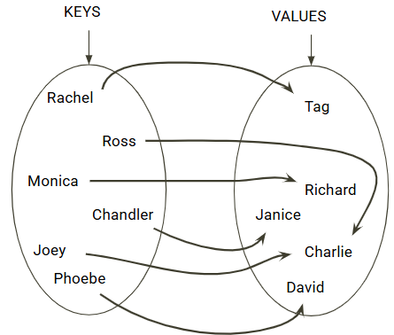
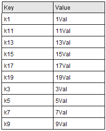
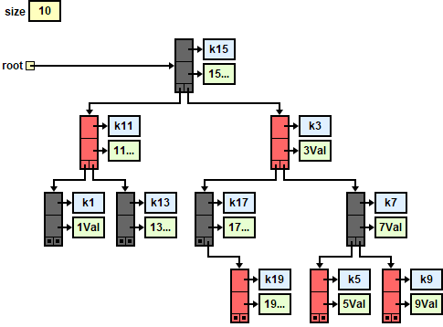

# Lesson G4: Maps

## Introduction
A `Map` is an `interface` that offers a data structure that acts a lot like an array except that the indices do not have to be integers. 

Let's say that you want to the ability to look up the age of individuals using their unique name. One way to solve this with arrays is to have two parallel arrays as follows: 

```java
int[] ages = { 15, 18, 3, 4 };
String[] names = { "Rishitha", "Zainab", "Prithu", "George" };

// look up the age of `name`
for (int i = 0; i < names.length; i++) {
    if (names[i].equals(name)) {
        System.out.printf("Age is %d\n", ages[i]);
    }
}
```
The above code take O(n) time to sequentially search the array. It is slow and long.

Wouldn't it be great if we could have a fast and "special" array where the *index* was the name? Then, to look up the age we'd greatly simply the code to be:
```java
// Code to create special "array" is not shown
SpecialArray[] special = ... ;

// Look up the age of `name`
System.out.printf("Age is %d\n", special[name]);
```
The above code takes O(1) and has no loops! **Maps** allow us to accomplish the same thing, but we need to use generics syntax and use APIs for indexing. Furthermore, just like with `ArrayList`, we are restricted to `Object` types. Here is how the `Map` code would look:
```java
// Create a map where the Index (or Key) is a String
// and the Value is an Integer.
Map<String, Integer> map = new HashMap<>();
map.put("Rishitha", 15);   // special["Rishitha"] = 15
map.put("Zainab", 18);     // special["Zainab"] = 18
map.put("Prithu", 3);      // special["Prithu"] = 3
map.put("George", 4);      // special["George"] = 4

// Look up the age of `name`
System.out.printf("Age is %d\n", map.get(name));
```

## Working with Maps
A map holds a set of unique keys and a collection of values, where each key is associated with one value. The basic map operations are:  
* `put(key, value)`: Adds a mapping from a key to a value.  
* `get(key)`: Retrieves the value mapped to the key.  
* `remove(key)`: Removes the given key and its mapped value.  
  

### Iterating a Map
We iterate through the Set of Keys.
```java
    for (String word : map.keySet()) {
        System.out.printf("%10s: %2d\n", word, map.get(word));
    }
```
Or, we get the Entry Set and iterate through that:
```java
for (Map.Entry<String, Integer> entry : map.entrySet()) {
    System.out.printf("%10s: %2d\n", entry.getKey(), entry.getValue());
}
```
Order is unknown in a `HashSet`.

## Concrete Maps

Here we will look at the two most popular implementations for a Map. In this example, we will have the following Key/Values.  
  

### HashMap
The Keys and Values are stored in a node in a Hash Table. It is beyond the scope of this lesson to discuss [Hashing](https://cse163.github.io/book/module-9-miscellaneous-topics/lesson-26-reading-hashing/index.html). 
  
What we hope to illustrate here is that because a `HashMap` uses a hash table to store its nodes, we get the following characteristics:  
* Getting, Adding and Removing a key/value is O(1)  
* There is no predictable enumeration order to the keys in a `HashMap`.  


### TreeMap
The Keys and Values are stored in a node in a Binary Search Tree. (Balanced using Red-Black Tree algorithms) 
  
Because the nodes are stored in a Binary Search Tree, we get the following characteristics:  
* Getting, Adding and Removing a key/value is **O(ln N)**  
* The keys can be enumerated in a predictable, sorted order.  

### LinkedHashMap
In this...

## Key Requirements
There are some requirements for the Objects that act as keys in a Map. The requirements are **not** enforced so if a developer doesn't follow them then the behavior can get wild!  

### Immutability
Keys should ideally be immutable. This ensures that the hash code and equality do not change while the key is in the map. If the key changes, and the hash code changes, then the `HashMap` will have problem when doing a lookup. This immutability must last over the lifetime of the map unless the key is removed and reinserted.  

### Equals and hashCode are Consistent
The two methods, `equals` and `hashCode`, need to be proper and consistent with each other. If two keys are considered equal via `equals()`, they must return the same `hashCode()`.   

### Sortable
When using a `TreeMap<K, V>`, the keys must either:  
* Implement the `Comparable<K>` interface, **OR**  
* Be used with a custom `Comparator<K>` provided when the `TreeMap` is constructed.  


