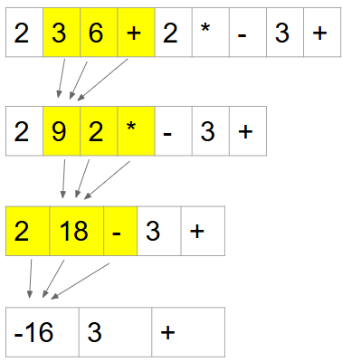
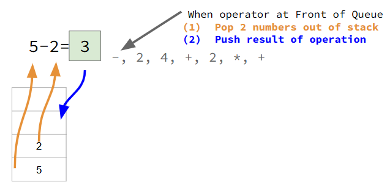
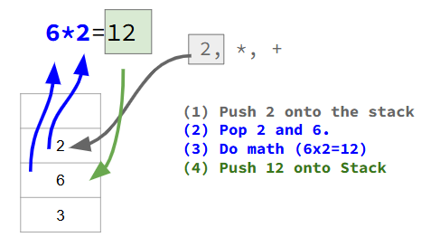
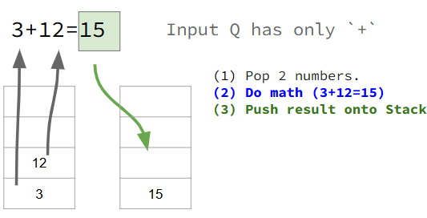

# Lesson G3: Shunting Yard

Here we will learn how to convert an infix mathematical expression to a postfix expression using the [Shunting Yard Algorithm](https://en.wikipedia.org/wiki/Shunting_yard_algorithm). To keep things simple, we will assume that all operators are [left-associative](https://en.wikipedia.org/wiki/Operator_associativity).   

First, we need to know what a postfix expression and how to evaluate it.

## Postfix Expressions
A postfix expression is a mathematical expression where the operator comes **AFTER** the operands. For example:  
|Infix|Postfix|
|-----|-------|
|5 + 3| 5&nbsp; 3&nbsp; +|

When we have a larger postfix expression, we can visually compute the result using a relatively simple approach. Here are the steps:  
1) Scan from the left to the right until an operator is found. 
2) Do the math and compress the expression.  
3) Repeat until there is only one token in the queue, which is the answer.  


Consider the expression shown above. Here are the specific steps.   
1) Find the `+` operator as the left-most operator.  
2) Compute `3 + 6 = 9`  
3) Remove `3`, `6`, and `+` and replace with `9`
4) Find the `*` operator. Compute `9 * 2 = 18`  
5) Remove `9`, `2`, and `*` and replace with `18`  
6) Find the `-` operator. Compute `2 - 18 = -16`
7) Remove `2`, `18`, and `-` and replace with `-16`  
8) Find the `+` operator. Compute `-16 + 3 = -13`  
9) Remove `-16`, `3`, and `+` and replace with `-13`  
10) Queue has only one Token. Answer = `-13`  

### Why Postfix?
We are learning postfix expressions because:    
1) There are **NO** parentheses in postfix expressions.  
2) Even without parentheses, the order of operations is encoded in the ordering of the tokens.  
2) Computers can easily compute the result of a postfix expression using a Stack.  

### Evaluating Postfix with a Stack
Let's examine the postfix expression: `5  2 - 2  4  +  2  *  +`  

> For the curious, the matching infix expression is: `(5 - 2) + (2 + 4) * 2 = 15`   

The general approach is as follows.  
When the input queue...  
1) is a number, push it  
2) is an operator  
```
    pop to the right  
    pop to the left  
    do the math  
    push the result
```  
3) is empty, the stack contains the final result.  

Let's take a more graphical look where we evaluate the expression `5  2 - 2  4 + 2 * +`  
  
In the above image you'll see that the stack has two numbers in it. The front of the input queue is an operator, `-`. We pop off the two numbers, compute `5 - 2 = 3` and push the `3`.  

Let's continue...
  
After the above operations, we stack becomes `[3, 6]`.  Then we continue to process the postfix expression.   

   
Now the stack becomes `[3, 12]` and the input queue has only `+`.   
 

With the input queue now empty, the stack has only one item in it, the result = `15`. 

### The Code (left as an exercise)
The code to evaluate a postfix expression is surprisingly simple! It is so simple, we leave this as an exercise for the reader.  

All we need now is a way to take any infix expression--including one with parentheses--and to convert it to a postfix expression without parentheses. **This is what the Shunting Yard Algorithm does!!!**

## The Shunting Yard Algorithm
The Shunting Yard Algorithm converts any infix expression, including one with parentheses, and converts it to a postfix expression without parentheses.  

A great way to learn the algorithm is to watch it in action and figure out the rules as you go. (Just like you do when you learn to play a new card game.) Below is a video that illustrates the processing of an infix expression and explains the steps as it goes. No code is shown; students should identify and write down the rules as they are identified. 

The video will illustrate the conversion of the following expressions:  
|Infix|Postfix|
|-----|-------|
| `5 + 7 + 2 + 1 - 3 + 2`| `5 7 + 2 + 1 + 3 - 2 +` |
|`(1 + 2) x 3 / (1 * ( 4 / 2 ) )` | `1 2 + 3 x 1 4 2 / * /`|
|`( ( 1 + 2 ) x 3 + 1 ) x 2` |`1 2 + 3 x 1 + 2 x`|
|`( ( ( ( ( 1 + 2 )  x 3 - 1 ) ) ) ) x 2`| `1 2 + 3 x 1 - 2 x`|


<iframe width="560" height="315" src="https://www.youtube.com/embed/O6YKiEHuSfE?si=wdasc1SMkxBF5Nim" title="YouTube video player" frameborder="0" allow="accelerometer; autoplay; clipboard-write; encrypted-media; gyroscope; picture-in-picture; web-share" referrerpolicy="strict-origin-when-cross-origin" allowfullscreen></iframe>

### Rule Summary
Here we assume that every operator is left-associative. For brevity, we will refer to the output queue as simply **the output**, and we will refer to the operator stack as simply **the stack**. 

If the input Token is:  
* number: always add it to the output  
* `(`: always push to the stack  
* `)`: pop off the stack, adding to output, until we find `)`. Discard parentheses.  
* operator: 
```java
    while (cannot push to stack) { 
        pop off the stack, adding it to output 
    }
    push input operator to stack
```

To determine if we can push to the stack, use the following rules.  

We can push to the stack when:  
* stack is empty  
* top of stack is `(`  
* precedence of input operator is greater than precedence of top of stack operator  

### Shunting Yard Example
Let's look at an example. TODO!!

## What's so Important? 
**Postfix Expressions:**   
* A postfix expression has no parenthesis yet still retains order of operations.  
* A computer can easily evaluate a postfix expression using a Stack.  

**Shunting Yard:** 
* The Shunting Yard Algorithm is used to **convert an infix expression into a postfix expression**.  
* The input is a Queue of Tokens (infix). The output is a Queue of Tokens (postfix).   
* It uses a Stack to help it produce the output.  