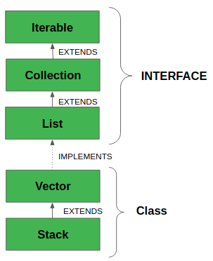
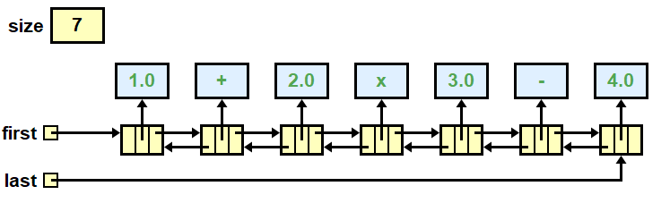

# Stack & Queue
In this lesson, we will learn about two Collection classes, `Stack` and `Queue`.

## Overview
A `Stack` is an Abstract Data Type (ADT)<a href="#footnotes"><sup>[1]</sup></a> that is provided by the [Java Collections Framework](https://docs.oracle.com/javase/8/docs/technotes/guides/collections/overview.html). It is a Generic just like `ArrayList` and therefore can hold only `Objects`. A `Stack` is a concept that is found in many different programming lanagues. In Java, a `Stack` is also a concrete class.<a href="#footnotes"><sup>[2]</sup></a> The two most common operations to perform on a Stack is `push` (add an item to the data structure) and `pop` (remove an item from the data structure). As the name *stack* infers, you can think of the data structure like a stack of books. To add a book to the stack, you **push** it to the top. To remove a book from the top of the stack, you **pop** it off. Fortunately, the API that invoke the behaviors have the same name.

```java
    Stack<Book> books = new Stack<>();
    books.push(new Book("Misquoting Jesus"));
    books.push(new Book("The Da Vinci Code"));

    Book top = books.pop();  // the book on top of the stack is "The Da Vinci Code"
```

A `Queue` is a fancy word for a *line*, as in the line you stand in while waiting to get into the concert. In proper English, as spoken in Great Britian, you don't stand in the *line*, you stand in the *queue.* The data structure works just like queue you stand in. When you are added to the queue, you go to the end of the line. The next person allowed into the concert, the one to come out of the line next, is the person at the front of the line.  

## Stack
Stacks are a super simple data structure. They are an ordered collection of elements, meaning that where elements are located in the data structure is instrumental in how it behaves. The most important position in the stack is being on top. Elements are pulled off the top of the stack when we `pop`, and they are added to the top of the stack when we `push`. There are times we want to know which element is on top without removing it, which we can do with the API, `peek`. 
  

Stacks are used extensively used by Java (*all programming languages, really*) when methods are called. When a method is invoked, a data structure called a **Stack Frame** is pushed onto `The Stack`. A Stack Frame contains all the method arguments, local variables, and the return address of the calling method. We need the return address so that the computer knows where to resume execution when the method finishes.  

**The Stack** is a special area of memory that stores Stack Frames. The Stack grows just like the data structure grows. New stack frames are pushed to the top of the stack. Old stack frames are popped off the top. The stack has a maximum size that can, at times, not be large enough. For example, a poorly coded recursive method without a good exit case may call itself infinitely. At each recursive call, a new stack frame is added to the stack. After a while, the stack runs out of space and the stack frames overflow. This is called a **Stack Overflow Exception**.

### LIFO
A Stack is "LIFO": **L**ast **I**n **F**irst **O**ut. This means that the last item that was pushed onto the stack is the item that is popped out.  

### class Stack&lt;E&gt;
In Java, we can get a stack implementation from the `Stack` class. It is a concrete class and can be instantiated directly. It is **NOT** and `interface`. What is especially nice about the `Stack` class is that it implements the stack behaviors with the expected names; it provides methods with the names `pop`, `push` and `peek`.   
```java
Stack<Integer> stack = new Stack<>();
stack.push(5);  // First In - Last Out. Bottom of stack
stack.push(3);  // middle of stack
stack.push(1);  // top of stack

int top = stack.peek();     // top of stack is unchanged. top is 1
int popTop = stack.pop();   // top of stack is removed. popTop is 1
int newTop = stack.peek();  // newTop is 3 since 1 was removed. 
```

If we look at the class hierarchy of `Stack`, we'll see that it is implemented by extending `Vector` which is thread-safe (or `synchronized`), meaning that it works well in a multi-threaded context. Unfortunately, it also means that the data structure is slower in a single-threaded context. Use of `Stack` is generally discouraged.   
  

### class ArrayDeque&lt;E&gt;
The `ArrayDeque` class (pronouned "Array Deck") is short for **Double-Ended Queue**, and because it provides a rich set of methods for working at both ends of a queue, it can be efficiently used to implement both a Stack and a Queue. Furthermore, most of the familiar behaviors keep their familiar names. We can abstract the Stack behaviors using the `Deque` interface:  
|Stack Behavior|Deque Method Name|Notes|
|--------|-----------|-----------|
|**push**|`push`|Adds to the Head|
|**pop**|`pop`|Removes from the Head|
|**peek**|`peek`|Looks at the Head|
|**empty**|`isEmpty`|`true` if empty|

```java
// Example: Using an ArrayDeque to be a Stack
Deque<Integer> stack = new ArrayDeque<>();

// Yes, it behaves like a STACK!
stack.push(3);
int top = stack.pop();
```
## Linked List
For many reasons, it is helpful to understand the `LinkedList` data structure which is implemented as a **Doubly Linked List**. This means that each `Node` in the data structure references the item in front of it as well as the one behind it. The `Node` class has three instance fields: 1) an `item` that contains user provided information; 2) the `next` node reference; 3) the `previous` node reference. Here is the code.
```java
class Node<E> {
        E item;         // The nodes holds some information
        Node<E> next;   // The node behind this node. May be null.
        Node<E> prev;   // The node ahead of this node. May be null.
}
```
The `LinkedList` data structure will have a reference to the `first` and `last` `Node` in a list that are connected together with a sequences of references. They are *chained*  together twice. One *chain* goes forward while the second *chain* goes backwards.  

Here is an illustration of a Linked List that has 7 items. The first item contains a `Token` that has the value `1.0`. The second item contains a `Token` that has the `+` operator. The last node in the list is contains the `Token` that has the value `4.0`.  
  

One of the nicest properties of a LinkedList is that adding Nodes to the Head or Tail is cheap: O(1)--constant time! If you want to add a Node to the middle of the list, the implementation requires that you follow the chain from the front (or tail) until you find the location that you want to add the new node. Once found, it is very easy to insert the new node: you just update the forwards & backwards references to include the new nodes. You update both *chains*.  

One negative propery of a `LinkedList` is that finding the location of a node is expensive because you have to traverse the chain to the desired location. Even if you know that you want to go to the 5th item, you still have to traverse from 0 to 1 to 2 to 3 to 4 to 5.  

Another negative property of a `LinkedList` is that the nodes are allocated on the Heap at discontiguous locations. While it is nice to allocate memory only when you need it, it can be poor performance to allocate one at a time and at disparate locations. 

```{admonition} ArrayDeque Performance
:class: dropdown
We will see below that an `ArrayDeque` can provide better performance by using an Array to achieve [Random Access](https://en.wikipedia.org/wiki/Random_access). It will also allocate memory for all elements all at once in a contiguous array. This generally improves performance except in the case when we need to insert a node. It behaves like an `ArrayList` where all elements need to be shifted over which is an expensive operation.
```  

## Queue
A `Queue` is an `interface` and therefore cannot be directly instantiated. Instead, you need to create the Queue *behavior* by instantiating one of the implementing classes such as `LinkedList` or `ArrayDeque`. 

Developers will often want to provide some level of abstraction and use an `interface` instead of a concrete class. The recommended code is:
```java
// Both of these are valid
Queue<Integer> que1 = new LinkedList<>();
Queue<Integer> que2 = new ArrayDeque<>();
que1.add(1);    // First in - First out
que1.add(2);
que1.add(3);

int front = que1.peek();     // front is 1
int removed = que1.remove(); // remove 1
int newFront = que1.peek();  // newFront is 2
```
|Queue Behavior|`Queue` Method Name|Notes|
|--------------|-----------------|-----|
|**enqueue**|`add`|Adds to the Tail|
|**dequeue**|`poll` or `remove`|Removes from the Head|
|**peek**|`peek`|Looks at the Head|
|**empty**|`isEmpty`|`true` if empty|

```{admonition} Deque
:class: dropdown
`Deque` extends `Queue`. This means that the `interface` Deque has all the behaviors that `Queue` has plus more. In fact, `Deque` provides the methods necessary to implement **BOTH** a Stack and a Queue. 
```

## Footnotes
[1] An **Abstract Data Type** (ADT) is a conceptual model for a data structure that defines:  
* What **operations** can be performed on the data.  
* What **behavior** those operations have.  
* But **not how** the data is implemented internally.  

In other words, an ADT focuses on **interface** and **behavior**, **not** implementation.  

Common ADTs (in the Collections Framework) include:  
* **List**: add, remove, get by   
* **Stack**: push, pop, peek  
* **Queue**: enqueue, dequeue  
* **Map**: put, get, remove by key  
* **Set**: add, remove, check membership  

A `String` is also an ADT. The ADT Characteristics of String are:  
* It encapsulates a sequence of characters.  
* It provides a rich set of operations: substring(), charAt(), indexOf(), concat(), etc.  
* It hides the internal representation (e.g., character array).  

[2] A `Concrete Class` is a class that can be instantiated (i.e. it can be created directly with the `new` operator). Most classes that students have learned thus far have been concrete classes. Alternatives to concrete classes would be `abstract` classes and interfaces. Because `Stack` is a concrete class and `Queue` is an interface, we have the follow legal and illegal code:
```java
    Stack stack = new Stack<String>();   // ✅ it is legal to do new Stack 
    Queue queue = new Queue<String>();   // ❌ Cannot new Queue, it is an interface
    Number num = new Number();           // ❌ Cannot new Number, it is an abstract class
```