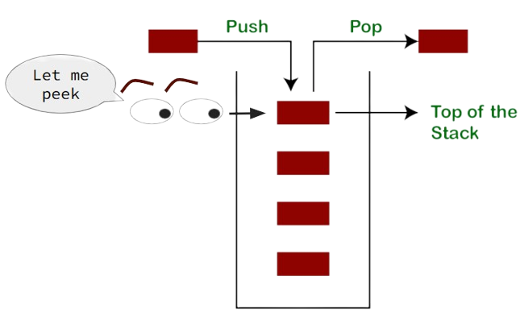

# Stack & Queue
In this lesson, we will learn about two Collection classes, `Stack` and `Queue`.

## Overview
A `Stack` is an Abstract Data Type (ADT)<a href="#footnotes"><sup>[1]</sup></a> that is provided by the [Java Collections Framework](https://docs.oracle.com/javase/8/docs/technotes/guides/collections/overview.html). It is a Generic just like `ArrayList` and therefore can hold only `Objects`. A `Stack` is a concept that is found in many different programming lanagues. In Java, a `Stack` is also a concrete class.<a href="#footnotes"><sup>[2]</sup></a> The two most common operations to perform on a Stack is `push` (add an item to the data structure) and `pop` (remove an item from the data structure). As the name *stack* infers, you can think of the data structure like a stack of books. To add a book to the stack, you **push** it to the top. To remove a book from the top of the stack, you **pop** it off. Fortunately, the API that invoke the behaviors have the same name.

```java
    Stack<Book> books = new Stack<>();
    books.push(new Book("Misquoting Jesus"));
    books.push(new Book("The Da Vinci Code"));

    Book top = books.pop();  // the book on top of the stack is "The Da Vinci Code"
```

A `Queue` is a fancy word for a *line*, as in the line you stand in while waiting to get into the concert. In proper English, as spoken in Great Britian, you don't stand in the *line*, you stand in the *queue.* The data structure works just like queue you stand in. When you are added to the queue, you go to the end of the line. The next person allowed into the concert, the one to come out of the line next, is the person at the front of the line.  

## Stack
Stacks are a super simple data structure. They are an ordered collection of elements, meaning that where elements are located in the data structure is instrumental in how it behaves. The most important position in the stack is being on top. Elements are pulled off the top of the stack when we `pop`, and they are added to the top of the stack when we `push`. There are times we want to know which element is on top without removing it, which we can do with the API, `peek`. 
  

Stacks are used extensively used by Java (*all programming languages, really*) when methods are called. When a method is invoked, a data structure called a **Stack Frame** is pushed onto `The Stack`. A Stack Frame contains all the method arguments, local variables, and the return address of the calling method. We need the return address so that the computer knows where to resume execution when the method finishes.  

**The Stack** is a special area of memory that stores Stack Frames. The Stack grows just like the data structure grows. New stack frames are pushed to the top of the stack. Old stack frames are popped off the top. The stack has a maximum size that can, at times, not be large enough. For example, a poorly coded recursive method without a good exit case may call itself infinitely. At each recursive call, a new stack frame is added to the stack. After a while, the stack runs out of space and the stack frames overflow. This is called a **Stack Overflow Exception**.

### LIFO
A Stack is "LIFO": **L**ast **I**n **F**irst **O**ut. This means that the last item that was pushed onto the stack is the item that is popped out.  

## Queue
A `Queue` is an interface and therefore cannot be directly instantiated. Instead, you need to create the Queue behavior by instantiating one of the implementing classes such as `LinkedList` or `ArrayDeque`. 


## Footnotes
[1] An **Abstract Data Type** (ADT) is a conceptual model for a data structure that defines:  
* What **operations** can be performed on the data.  
* What **behavior** those operations have.  
* But **not how** the data is implemented internally.  

In other words, an ADT focuses on **interface** and **behavior**, **not** implementation.  

Common ADTs (in the Collections Framework) include:  
* **List**: add, remove, get by   
* **Stack**: push, pop, peek  
* **Queue**: enqueue, dequeue  
* **Map**: put, get, remove by key  
* **Set**: add, remove, check membership  

A `String` is also an ADT. The ADT Characteristics of String are:  
* It encapsulates a sequence of characters.  
* It provides a rich set of operations: substring(), charAt(), indexOf(), concat(), etc.  
* It hides the internal representation (e.g., character array).  

[2] A `Concrete Class` is a class that can be instantiated (i.e. it can be created directly with the `new` operator). Most classes that students have learned thus far have been concrete classes. Alternatives to concrete classes would be `abstract` classes and interfaces. Because `Stack` is a concrete class and `Queue` is an interface, we have the follow legal and illegal code:
```java
    Stack stack = new Stack<String>();   // ✅ it is legal to do new Stack 
    Queue queue = new Queue<String>();   // ❌ Cannot new Queue, it is an interface
    Number num = new Number();           // ❌ Cannot new Number, it is an abstract class
```