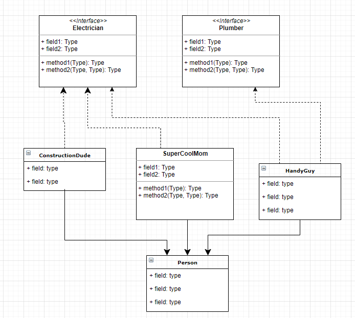

# Interfaces 101

```{admonition} Definition
*Interface*: A contract that promises a specific behavior.
```

## Overview
In this lesson you will...  
1. Understand the difference between an interface and a class.  
2. Create an interface and a class that makes a promise via the `implements` keyword.  
3. Get access to interface methods via casting (aka *type casting*).  
4. Ask an object if it implements an interface via the `instanceof` keyword.  
5. Understand the `IS-A` relationship  


## Implements
An `interface` is a list of methods that a class must implement.
An interface is very much like a `class`, but the methods don’t have an implementation.<a href="#footnotes"><sup>[1]</sup></a> Methods that don't have an implementation are called `abstract`. 

### Example Interface
```java
public interface Electrician {
   public abstract void installLights(int room);
   public abstract void addCircuitBreaker();
   public abstract void fixLightSwitch(int light);
   public abstract double chargeOverpricedServiceFee();
}
```
Note that the above code makes use of the keywords `public` and `abstract`. In an interface, all the methods are **required** to be public and are *implicitly* declared as such.  Furthermore, all the methods in an interface are *implicitly* declared as `abstract`. We could have left out those keywords as shown below.

```java
// We leave out the implicit keywords, public abstract.
public interface Electrician {
   void installLights(int room);
   void addCircuitBreaker();
   void fixLightSwitch(int light);
   double chargeOverpricedServiceFee();
}
```
With the above code in its own file, `Electrician.java`, we can then create a `class` that `implements` the `interface` as follows.
```java
public class HandyGuy extends Person implements Electrician {
    // This class must provide code for all the methods belonging
    // to the interface Electrician. The keyword `abstract` must now
    // be omitted because we are implementing the methods.
   public void installLights(int room) { /* code not shown */ }
   public void addCircuitBreaker() { /* code not shown */ }
   public void fixLightSwitch(int light) { /* code not shown */ }
   public double chargeOverpricedServiceFee() { /* code not shown */ }
}
```
```{admonition} Note
`interface`: An interface is a *promise* or a *contract*.  
```
When a class `implements` an interface, it is required to implement each method. <a href="#footnotes"><sup>[2]</sup></a> The class is effectively making a promise to *behave* like the interface.

> Interfaces are analogous to the idea of *roles* or *certifications*:
>   > "I'm certified as a Plumber. That means I can do all the things that you’d expect a plumber to do."  
>
>   > "I'm certified as an Electrician. That means I can do all the things that you’d expected an electrician to do."  


## Implements vs Extends
The keyword `implements` is quite a bit different from `extends`. The former is a promise to **implement** the required *behavior*. The latter is shamelessly **inheriting** the behavior from its *parent*.   

**Implements**:  
🔹 An interface is a list of methods that a *concrete* class must implement.  
🔹 Classes may implement many different interfaces.  
🔹 All methods are public.  
🔹 An interface has no state (no instance fields).  
🔹 An interface gives you an **is-a** relationship.   
🔹 Often times there is no code reuse.<a href="#footnotes"><sup>[3]</sup></a>  
 
**Extends:**  
🔹 Classes may have only one parent.  
🔹 Child classes inherit methods.  
🔹 Methods can be private, protected, public.  
🔹 Classes may have instance fields.  
🔹 Inheritance gives you an **is-a** relationship with lots of code-reuse.  

```{admonition} Note
`extends`: Classes can extend only one class
`implements`: Classes can implement any number of interfaces
```

## Why use an interface?
An interface allows you to uniformly treat objects that have a different class hierarchy because they implement the a required interface. In other words, we can have a method that takes an interface as an argument. This does not restrict the class type of the object because any class can implement any interface. It allows us to circumvent the limitation of single inheritance; it allows for greater flexibility in design and extensibility.   

Interfaces are very popular in the industry where there are many teams working on different components of a large system. The teams agree on interfaces and are free to implement however they want.   

Interfaces allow completely new implementations to be plugged into an existing system. It is easier to maintain and extend.    

Interfaces act as the *TYPE* of a function which opens up the ability to do *Functional Programming*.  Interfaces allow an imperative<a href="#footnotes"><sup>[4]</sup></a> language the ability to offer some characteristics of a functional<a href="#footnotes"><sup>[5]</sup></a> programming language.

Interfaces are used to define **event handlers** or **callbacks** that are used in GUI programming.  Furthermore, `functional interfaces`<a href="#footnotes"><sup>[6]</sup></a> can be implemented with `lambda` expressions or `method references` which give us a good amount of flexibility and power.  

Interfaces are used in Collection Classes, Streams, unit testing, parallel programming, and more!!  

## Multiple Implementations
Below is code that shows how a class can both extend a class and implement two interfaces. Notice how we use the keyword `implements` only once. Furthermore, we are still allowed to extend from a parent class.  

```java
public class HandyGuy extends Person implements Electrician, Plumber  {
  // implement methods in Electrician
   public void installLights(int room) { /* code not shown */ }
   public void addCircuitBreaker() { /* code not shown */ }
   public void fixLightSwitch(int switchNum) { /* code not shown */ }
   public double chargeOverpricedServiceFee() { /* code not shown */ }
   
   // implement methods in Plumber
   public void installPressureReliefValve() { /* code not shown */ }
   public void installDishwasher() { /* code not shown */ }
   public void installFaucet() { /* code not shown */ }
   public void fixLeak() { /* code not shown */ } 
}
```
## instanceof
Let's say that we have a program that wants to put various people to work. The method below `putPersonToWork` accepts any object that `is-a` `Person`. Perhaps this person has the certification to do the work of a Plumber or an Electrician. To determine this we need to ask the object `p` if it implements an interface using the keyword `instanceof`. 

Below you'll see how we use `instanceof` to determine if we can ask an identifier to behave as a Plumber. It is important to note that we must first **cast** p into a Plumber before using any of the Plumber behaviors. The compiler will attempt to protect the programmer from misusing a Person by not allowing a Person idenfier to call any methods it does implement or inherit.  Without the cast at line 11, the compiler will fail at line 14 (`error: cannot find symbol`).   

The nice thing about this code is that it will work with any `Person` object. If the person is a Plumber, it will do plumber work. It the person is an electrician, it will do electrician work. In either case, we know that we can get the person's name.  

```{admonition} Dot Operator
:class: note dropdown
We can have idenfiers that references an `interface` or an instance of a `class`. In both cases, to invoke a method, we use the "dot operator".  

For example:  
Below we have `Person p`. If we wanted the name of the person, we would get access to it using: `p.getName();` Notice that the method `getName` is defined in the Person class. 

We cast `p` into a `Plumber` (an interface) with `Plumber joe = (Plumber) p`. To call any of the interface's methods, we similarly use the "dot operator". For example: `joe.fixLeak();`

```

```{code-block} java
:linenos:
:emphasize-lines: 9, 11, 14
public class Person {
    public String getName() { return "Mr. Stride"; };
}

public class ConstructionSite {

    public static void putPersonToWork(Person p) {
        // ask the person if she can act like a Plumber
        if (p instanceof Plumber) {
            // get access to Plumber methods by casting to a Plumber type.
            Plumber joe = (Plumber) p;

            // Now that `joe` is-a Plumber, we can treat it as a Plumber
            joe.fixLeak();
            joe.installFaucet();
            joe.installDishwasher();

            System.out.printf("%s did Plumber work!\n", p.getName());
        }

        // ask the person if she can act like an Electrician
        if (p instanceof Electrician) {
            // get access to Electrician methods by casting to an Electrician type.
            Electrician victor = (Electrician) p;

            victor.addCircuitBreaker();
            victor.fixLightSwitch(23);
            victor.installLights(2);

            System.out.printf("%s did Electrician work!\n", p.getName());
        }
    }
}

```

Here is a quick summary of the `instanceof` keyword.
```{admonition} instanceof Syntax
:class: note
`object instanceof ClassName`  
* `object`: the identifier you want to test  
* `ClassName`: the class or interface you want to test against

The expression returns a `boolean`. It returns `true` if `object` is an instance of ClassName.

```java
Person person = new HandyGuy();
if (person instanceof Electrician) {
    ...
}
```

## Abstraction & Extensibility
Let's say that you have written a method that will identify which Person should be nominated for an award. You might have a method prototype as follows:  
```java
public Person findWinner(ArrayList<Person> scientists) {
    /* Code not shown */
}
```
This code works fine until one day you discover that you want to build your list as a `LinkedList` so that it can be faster with inserting new people on the fly. You'd then have to change your prototype to accept a LinkedList and potentially modify the API used within the method itself. However, the better way to write the code would be to use the `interface List<T>`.  

```java
public Person findWinner(List<Person> scientists) {
    /* Code not shown */
}
```

Now the caller of the method can store the list in several different concrete classes that implement `List` such as: `LinkedList`, `Stack` or `Vector`.  The following code works great:  
```java
public void demoUsage() {
    List<Person> l1 = new ArrayList<Person>();
    List<Person> l2 = new LinkedList<Person>();
    List<Person> l3 = new Vector<Person>();
    List<Person> l4 = new Stack<Person>();
    /* populate each data structure with Person objects */
    ...

    // Find the winner in each data structure
    Person winner;
    winner = findWinner(l1);
    winner = findWinner(l2);
    winner = findWinner(l3);
    winner = findWinner(l4);
}
```

## Interfaces in UML
Interfaces are drawn in a UML class diagram similar to how classes are drawn, but with a few alterations.  
* The Interface box is decorated with `<<interface>>`.  
* We use dashed lines to represent the `implements` relationship.   

  


## Implements vs Extends

Let's summarize the similarities and differences between the keywords.  
  
|           |`implements`|`extends`|
|:-----------|---------|-----------|
|Provides|a promise|inheritance|
|Works with|`interface`|`class`|
|Code reuse?|limited<a href="#footnotes"><sup>[1]</sup></a>|Yes!|
|Multiple?|yes|no|
|Is-a relationship?|yes<br>(can-do, acts-like)|yes|
|has state|No state<br>No fields<br>Only methods|Yes, may have state (fields)|
|Type cast?|Yes|Yes| 


## Common Uses of Interfaces
Interfaces are powerful and common. Below is a list of ways interfaces are used. **You are not expected to understand all of these examples yet.** You should be familiar with these by the end of the lessons in this chapter.  

* **For Abstraction & Extensibility:** Here we see a method that accepts a `List<Integer>` instead of an `ArrayList<Integer>`. This allows the caller to use a variety of datastructures so long as they implement `List`, an interface. 
```java
public int calculateSumtin(List<Integer> list) { }
```

* **Functional Programming:** It is powerful to pass around functions as arguments or to have functions return functions. 

* **Callbacks that handle Events** is necessary and frequent in GUI Programming. This allows a program be be *Event Driven*, meaning that when the user of the application causes an event, code is triggered.  

* We can **Customize functionality** such as how a list is sorted. The next lesson dedicated to this activity.  

* We can **enable iteration in a for-each loop**.

* **Try-with-resources** is built into Java and it allows a programmer to easily and safely close resources. We often do this when working with files so that we don't need to call the `close()` method. For example, the code below will create the `Scanner` in a try-with-resources clause. Whether the file is found or not, we are guaranteed to close the Scanner object correctly. Any class that implements `AutoCloseable` can be used this way.
```java
public void readFile(String filename) {
    try (Scanner parser = new Scanner(new File(filename))) {
        while (parser.hasNext()) {
            System.out.println(parser.next());
        }
    } catch (FileNotFoundException ex) { 
        // Let the user know the file wasn't found
    }
}
```

* **Streams** are a powerful way to process data using functional programming. See future lessons on how to use Streams.  

## What's so important?   
* An `interface` has a lot of similarities to a class with a few key differences:  
    * Methods are typically `abstract`, meaning that they have no implementation and, therefore, do not offer code reuse to classes that implement the interfaces.  
    * Methods are required to be `public` and are implicitly `public abstract`.  
    * Fields are required to be `public static final` (no instance fields).  
* Classes can implement _many_ interfaces. This is one important property (of several) that makes interfaces powerful and popular.  
* Interfaces retain the `IS-A` relationship. If a class implements `X`, than an instance of that class is-a `X`. Classes have the same behavior. If a class extends `A`, then an instance of that class is-a `A`.   
* We can ask an object if it implements an interface by using the `instanceof` keyword.  

## Footnotes
[1] In reality, interfaces actually *can*, and often *do*, have implementation. An interface can have `default` and `static` methods, both of which are implemented. Methods that have no implementation are called `abstract`. Interfaces almost always have at least one abstract method, but this is not required. In this lesson, we introduce `interfaces` by saying that they have no implementation because this is a characteristic that helps us distinguish them from `classes`. However, confusingly enough, classes can *also* have `abstract` methods. It takes a seasoned developer to know when an `abstract class` is preferrable over an `interface` or vice versa.   

[2] It is possible for a class to declare that it implements an interface and then, in reality, not implement all the methods. However, in this case, the class itself would be `abstract`. When a class is `abstract`, one cannot create an instance of that direct class. Instead, one must create a subclass that implements all the `abstract` (unimplemented) methods. For example:  
```java
public abstract class AbstractElectrician implements Electrician {
   public void installLights(int room) { /* code not shown */ }
   public void addCircuitBreaker() { /* code not shown */ }
   public void fixLightSwitch(int light) { /* code not shown */ }

   /* This class does NOT implement chargeOverpricedServiceFee 
    * and therefore cannot be instantiated. A subclass is required to
    * to extend this class and implement the remaining abstract method */
}

public class ActualElectrician extends AbstractElectrician {
   public double chargeOverpricedServiceFee() { /* code not shown */ }
   /* Now that we've fully implemented all the abstract methods in the
    * Electrician interface, this class can be instantiated. */
}
```
[3] `interfaces` have the ability to provide some code reuse by offering `default` or `static` methods.  

[4] **Imperative** languages provide sequential instructions that describe how to accomplish something. They emphasize step-by-step execution where the program's state changes as commands are executed. Java is an *imperative* programming language. Let's contrast this with **declarative** programming languages which focus on *what* the program should accomplish rather than *how* to achieve it. CSS is a *declarative* lanaguage as it describes element styles, not the steps. Similarly, SQL will describe the data it wants to retrieve from the database, not how to retrieve it.   

[5] **Functional Languages** have the key feature of allowing *functions* to be treated as values that can be passed as arguments or returned from other functions. Many languages, including Java, offer the ability to pass functions as an argument. A more academic and rigorous definition of a *functional programming language* is centralizing around the paradigm that treats computation as the evaluation of mathematical functions and avoids changing state or mutable data. It emphasizes immutability, first-class functions, and declarative programming. Functional Languages include [F#](https://learn.microsoft.com/en-us/dotnet/fsharp/) and [Ocaml](https://pl.cs.jhu.edu/fpse/).  

[6] A **Functional Interface** is an interface that has only one `abstract` method. This means that only one method needs to be implemented. This allows for some nice shortcuts and syntactic sugar in implementation (to be seen in other lessons.)  